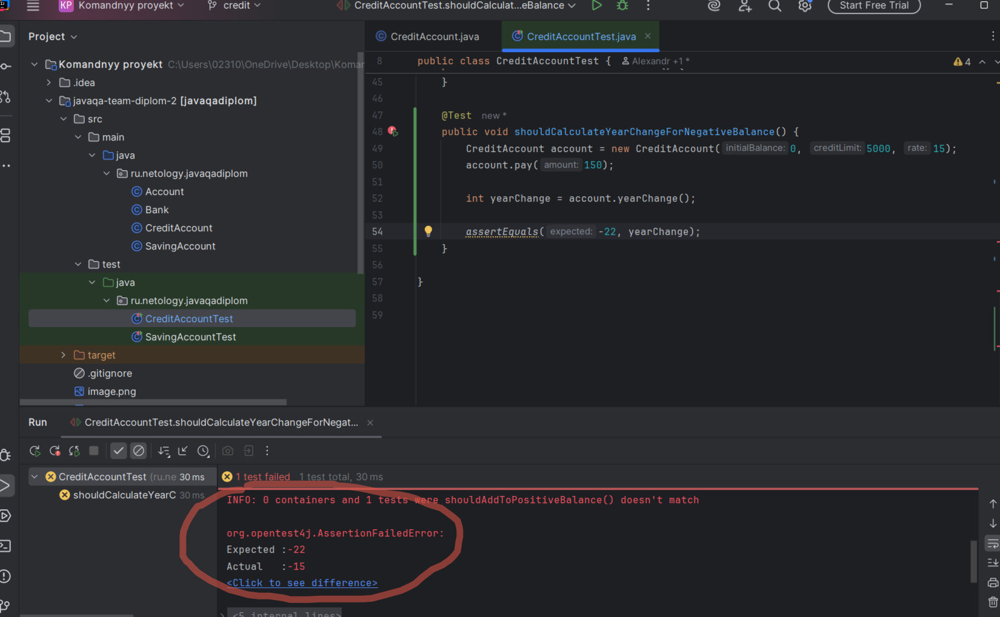

# Описание.
Метод yearChange некорректно рассчитывает проценты для отрицательного баланса.
# Локация дефекта:
        
https://github.com/netology-code/javaqa-team-diplom-2/blob/7e01d1602ba0e7787782ab0ac6d54e4d04a0db01/src/main/java/ru/netology/javaqadiplom/CreditAccount.java#L81C2-L84C3

# Шаги воспроизведения:

 
1. Открыть код программы в IDEA. 
1. Открыть класс для тестирования CreditAccountTest.java
1. Добавьте тестовый метод
1. Создать новый кредитный счет с начальным балансом 0 рублей и кредитным лимитом 5000 рублей:  CreditAccount account = new CreditAccount(0, 5000, 15)
1. Выполнить операцию оплаты: account.pay(150)
1. Рассчитать годовые проценты: account.yearChange()
1. Запустить тест
1. Посмотреть результат в консоли

*Ожидаемый результат:* Программа должна сказать: -22 рублей

*Фактический результат:* Программа говорит: -15 рублей
# Тест для проверки:

    @Test
    public void shouldFailYearChangeCalculation() {
    CreditAccount account = new CreditAccount(0, 5000, 15);
    account.pay(150);  // баланс становится -150
    
    int yearChange = account.yearChange();
    
    // По текущей (неправильной) логике: -150 / 100 * 15 = -1 * 15 = -15
    // По правильной логике: -150 * 15 / 100 = -2250 / 100 = -22 (целочисленное деление)
    assertEquals(-22, yearChange); }

# Скриншот:

# Окружение
* **Устройство:** ПК
* **Операционная система:** Windows 11,
* **Браузер:** Google Chrome Версия: 137.0.7151.120 (Официальная сборка)(64 бит)
* **JAVA:** OpenJDK 11
