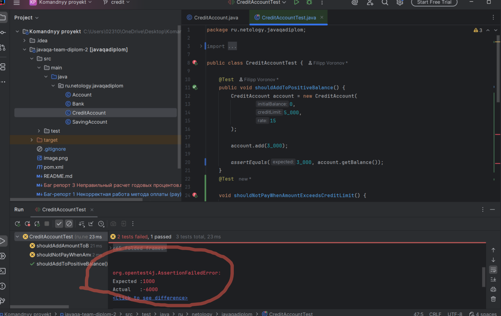

# Описание.
При выполнении операции оплаты баланс изменяется до проверки кредитного лимита.
# Локация дефекта:
        
https://github.com/Alexander0713/Komandnyy-proyekt/blob/7e01d1602ba0e7787782ab0ac6d54e4d04a0db01/src/main/java/ru/netology/javaqadiplom/CreditAccount.java#L44-L49

# Шаги воспроизведения:

1. Открыть код программы в IDEA. 
1. Открыть класс для тестирования CreditAccountTest.java
1. Добавьте тестовый метод
1. Создать новый кредитный счет с начальным балансом 1000 рублей и кредитным лимитом 5000 рублей
1. Попытаться оплатить 7000 рублей (превышаем доступный лимит)
1. Проверить результат операции и баланс после оплаты
1. Запустить тест
1. Посмотреть результат в консоли

*Ожидаемый результат:* Операция должна завершиться неудачей (вернуть false), баланс остаться неизменным (1000)

*Фактический результат:* Операция завершается неудачей, но баланс временно изменяется до -6000 перед возвратом false

# Тест для проверки:

    @Test
    
    void shouldNotPayWhenAmountExceedsCreditLimit() {
    
    // Создаем счет с балансом 1000 и кредитным лимитом 5000
    CreditAccount account = new CreditAccount(1000, 5000, 15);
    
    // Пытаемся оплатить 7000 (превышаем лимит)
    boolean result = account.pay(7000);
    
    // Проверяем что операция не прошла
    assertFalse(result);
    // Проверяем что баланс не изменился
    assertEquals(1000, account.getBalance());}

# Скриншот:

# Окружение
* **Устройство:** ПК
* **Операционная система:** Windows 11,
* **Браузер:** Google Chrome Версия: 137.0.7151.120 (Официальная сборка)(64 бит)
* **JAVA:** OpenJDK 11

