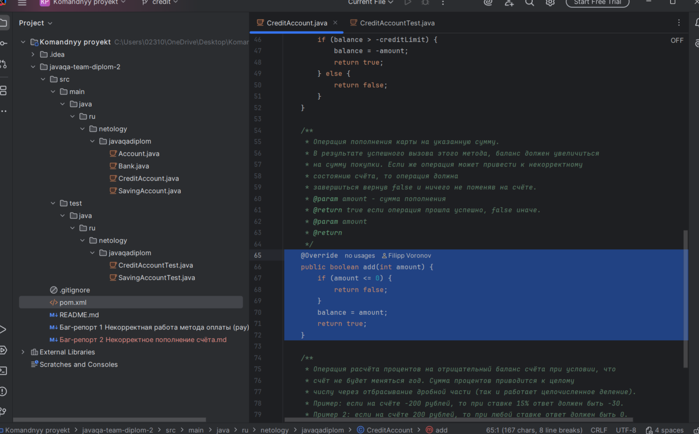

# Описание.

Метод add перезаписывает баланс вместо добавления суммы.

# Локация дефекта:

https://github.com/netology-code/javaqa-team-diplom-2/blob/7e01d1602ba0e7787782ab0ac6d54e4d04a0db01/src/main/java/ru/netology/javaqadiplom/CreditAccount.java#L68C1-L71C1

# Шаги воспроизведения:

1. Создать кредитный счет с начальной суммой 1000 рублей, максимальный долг: 5000 рублей, процентная ставка: 15%
1. Выполнить операцию пополнения на 500 рублей

# Тест для проверки:
    @Test
    void shouldAddAmountToBalance() {
    CreditAccount account = new CreditAccount(1000, 5000, 15);
    
    boolean result = account.add(500);
    
    assertTrue(result);
    assertEquals(1500, account.getBalance());}

*Ожидаемый результат:* Баланс должен увеличиться до 1500

*Фактический результат:* Баланс перезаписывается значением 500

# Скриншот:

# Окружение
* **Устройство:** ПК
* **Операционная система:** Windows 11,
* **Браузер:** Google Chrome Версия: 137.0.7151.120 (Официальная сборка)(64 бит)
* **JAVA:** OpenJDK 11